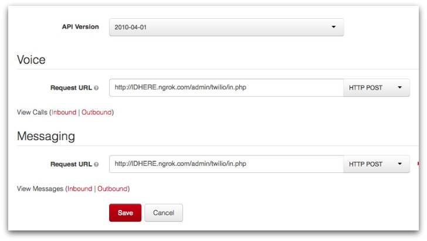

Twilio Scripts
==========

Testing Twilio functionality.

## Installation

Create a file called `config.php` and populate it with your Twilio account information:

	<?php

		$account_sid = ""; // your Twilio account sid.
		$auth_token = ""; // your Twilio auth token.
		$phone_number = "+12345678910"; // your Twilio phone number.
		$to = "+12345678910"; // who the script is sending the SMS to.

	?>

The `index.php` script shows you how to **send** message. [Read this article](https://www.twilio.com/blog/2014/09/getting-started-with-twilio-mms.html) for how to **receive** messages. Setting up ngrok is really simple and lets you have incoming message sent to a local script. You could use `in.php` for that.

